# Productionizing R workload with Amazon SageMaker

Welcome to reInvent 2020 AIML session 404 "Productionizing R workloads using Amazon SageMaker". 

R language and its rich ecosystem with more than 16,000 packages dedicated to statistics and machine learning are widely used by statisticians and data scientists in industries, such as energy, healthcare, life science, and financial services. Customers using R can run simulation and machine learning securely and at scale with Amazon SageMaker while also reducing the cost of development by using the fully elastic resources in the cloud. In this session, learn how to build, train, and deploy statistical and ML models in R at scale using Amazon SageMaker from your IDE.

In this repository, the code is provided for you to replicate the demo in the session. You are welcome to clone the repository while you watch the video. This Readme provides end-to-end instruction to run the demo. You can find the following sections:

- [Prerequisite](#Prerequisite)
- [Prototyping in RStudio](#prototyping-in-rstudio)
- [Scale with Amazon SageMaker](#scale-with-amazon-sagemaker): 
- [Orchestrate with AWS Step Functions](#orchestrate-with-aws-step-functions)
- [Additional resources](#additional-resources)

## Prerequisite
We assume you have an RStudio instance running on your laptop or on a EC2 instance. You need the following IAM policies: `AmazonSageMakerFullAccess` and `AmazonEC2ContainerRegistryFullAccess` to be attached to your IAM role and credential that is used in your environment, eg. [Amazon EC2](https://aws.amazon.com/premiumsupport/knowledge-center/assign-iam-role-ec2-instance/) or [local computer](https://docs.aws.amazon.com/cli/latest/userguide/cli-configure-files.html). The R libraries that are used in the demo are:
- fable==0.2.1, fabletool==0.2.1
- feasts==0.1.5
- tsibble==0.9.3
- reticulate==0.16
- dplyr==1.0.2
- ggplot2==3.3.2 

If you do not have an RStudio IDE, please follow the [instruction](./doc/prerequisite.md) to deploy an [RStudio Server](https://rstudio.com/products/rstudio/download-server/) on an EC2 instance with all the necessary permission and networking for your convenience.

Once you are logged into the RStudio IDE, please clone the code repository in the Terminal.

```bash
git clone https://github.com/aws-samples/reinvent2020-aim404-productionize-r-using-amazon-sagemaker.git
```

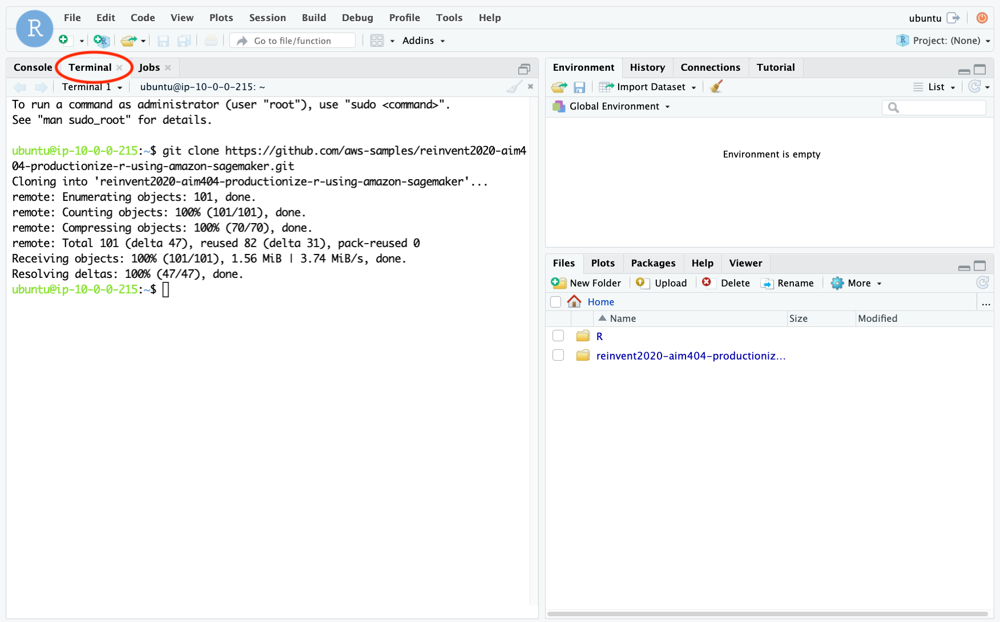

## Prototyping in RStudio
Suppose your customer send you a dataset and ask you to forecast the number of visitors to city of Melbourne in Australia for the next 5 years. Let’s start playing with the data. 

Let's start with the prototyping script [fable_demo.r](./fable_demo.r) where we do a simple exploratory analysis, visualization and modeling using exponential smoothing (ETS) and ARIMA algorithms from fable library to model the number of visitors from 1998-2007.

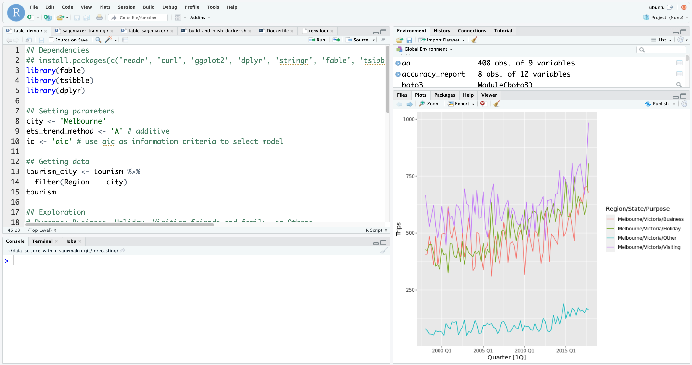

It is perfectly fine running small scale analyses, modeling and visualization on a local instance. But what if each of your modeling job takes an hour with complete dataset and you need to run 100s of them with various input and parameters. You either need to have a very large instance and run them both in parallel and in serial. 

## Scale with Amazon SageMaker

[Amazon SageMaker](https://aws.amazon.com/sagemaker/) can be helpful in running your statistical and ML workloads at scale using the fully elastic resource in the cloud beyond local compute resource. 

First of all, data scientists and developers can use Amazon SageMaker features through [SageMaker SDK](https://sagemaker.readthedocs.io/en/stable/) from any IDE as long as there is internet and AWS credential setup. For R users, you can use your preferred IDE, such as RStudio, and interact with [Amazon SageMaker SDK](https://sagemaker.readthedocs.io/en/stable/) through [reticulate](https://rstudio.github.io/reticulate/), an R interface for python libraries. You can also communicate with all AWS resources with [boto3](https://boto3.amazonaws.com/v1/documentation/api/latest/index.html). 

Depending on whether there is a model artifact as output for inferencing new data, the following two patterns can be leveraged to scale your ML or statistical workloads. 

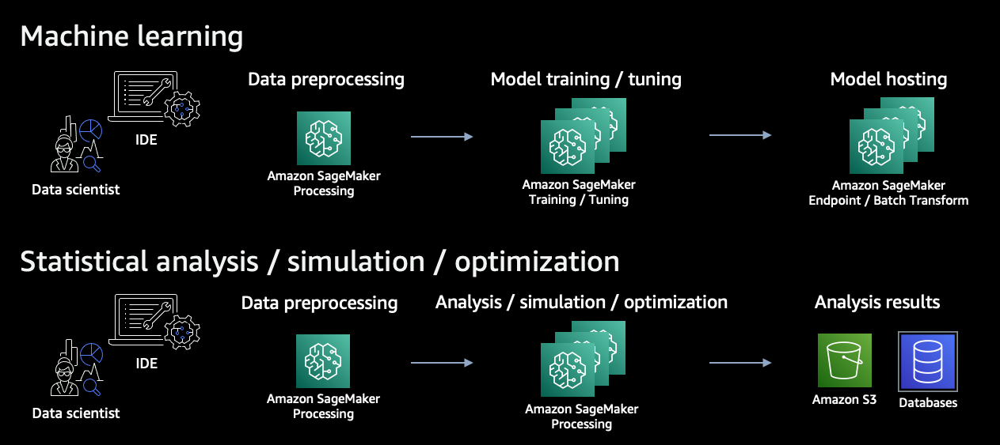

For machine learning, you can use Amazon SageMaker Processing to process the data, use Amazon SageMaker Training and Tuning to train an optimal model, and use Amazon SageMaker Endpoint to host the model for live traffic or Batch Transform for batch data.

For statistical analyses, simulations and optimizations where your output is data insight, you can use Amazon SageMaker Processing for both data processing and for your full scale statistical workloads, and save the results into Amazon S3 or purposefully built database on AWS.

### From prototype to SageMaker-ready
Let's walk through step-by-step to transform our prototype script ([`fable_demo.r`](./fable_demo.r)) to SageMaker-ready script ([`fable_sagemaker.r`](./fable_sagemaker.r)).

Amazon SageMaker runs your R script in a [Docker container image](https://docs.aws.amazon.com/sagemaker/latest/dg/docker-containers.html) with all the dependencies to make sure it operates in the exact manner how you develope the script. There are two changes we need to make to your R script:

#### 1. Make the script aware of how Amazon SageMaker places the input and config files when launching the job;
The input data and hyperparameters are accessible to your script inside a container with the following directory structure. 

```
/opt/ml
|-- input
|   |-- config
|   |   |-- hyperparameters.json
|   |   `-- resourceConfig.json
|   `-- data
|       `-- <channel_name>
|           `-- <input data>
|-- model
|   `-- <model files>
|-- processing (if with SageMaker Processing)
|   |-- input
|   `-- output
|
`-- output
    `-- failure
```
We should assign the path variables accordingly so that we can access the input data for analysis and modeling. (See [here](https://github.com/aws-samples/reinvent2020-aim404-productionize-r-using-amazon-sagemaker/blob/d3f784069fa7fa6032c004dd73d0566cc01af08e/fable_sagemaker.r#L31-L41))

```R
## Assigning paths
prefix <- '/opt/ml'
input_path <- file.path(prefix, 'input', 'data')
training_data_path <- file.path(input_path, 'train')
output_path <- file.path(prefix, 'output')
model_path <- file.path(prefix, 'model')
param_path <- file.path(prefix, 'input', 'config', 'hyperparameters.json')

processing_path <- file.path(prefix, 'processing')
processing_input_path <- file.path(processing_path, 'input')
processing_output_path <- file.path(processing_path, 'output')
```

#### 2. Refactor the code into `train`, `evaluate` as that how SageMaker execute the codes from the container for training, and evaluating the model. 
In our prototype, we do a forecast modeling, followed by an analysis of the model performance and a visualization. We need to refactor the codes in `fable_demo.r`, put the modeling part into the function [`train`](https://github.com/aws-samples/reinvent2020-aim404-productionize-r-using-amazon-sagemaker/blob/d3f784069fa7fa6032c004dd73d0566cc01af08e/fable_sagemaker.r#L43-L89) and the analysis into [`evaluate`](https://github.com/aws-samples/reinvent2020-aim404-productionize-r-using-amazon-sagemaker/blob/d3f784069fa7fa6032c004dd73d0566cc01af08e/fable_sagemaker.r#L91-L127). Amazon SageMaker calls the `train` and `evaluate` in a SageMaker Training job ([by default](https://docs.aws.amazon.com/sagemaker/latest/dg/your-algorithms-training-algo-dockerfile.html)) and SageMaker Processing job ([by design](https://docs.aws.amazon.com/sagemaker/latest/dg/build-your-own-processing-container.html#byoc-run-image)), respectively. We will talk more about how SageMaker Process calls the `evaluate` function.

```R
train <- function() {
## Extract (hyper)parameters
  ...
  ## Getting data from local path that is downloaded from S3
  ...
  ## Training ETS and ARIMA models
  fitted_model <- tourism_city %>%
    model(
      ets = ETS(Trips ~ trend(ets_trend_method), ic = ic),
      arima = ARIMA(Trips, ic = ic)
    )
  ## Saving the model
  ...
}

evaluate <- function(city) {
  ## Load model
  ...
  ## Load input data
  ...
  ## Analysis
  ...
  ggsave(file.path(processing_output_path,  'forecast-report.png'))
}
```

If you would like to host the model, you can do so inside a `serve` function which can be called by [SageMaker hosting features](https://docs.aws.amazon.com/sagemaker/latest/dg/your-algorithms-inference-main.html).

### Getting started with SageMaker SDK
Now we are ready to run the script [fable_sagemaker.r](./fable_sagemaker.r) with Amazon SageMaker. Let's open the script [sagemaker_training.r](./sagemaker_training.r) and sets the working directory to where the scripts are. This script allows us to communicate with Amazon SageMaker using the SageMaker SDK through reticulate, a R interface to python libraries. 

```R
# Remember to set the current working directory to where the code is.
# For example if you clone the repo in home, then set the working directory as  
# setwd("~/reinvent2020-aim404-productionize-r-using-amazon-sagemaker")

## Getting libraries
library(reticulate)
use_python('/usr/bin/python') # instruct reticulate to use the system python
sagemaker <- import('sagemaker')
boto3 <- import('boto3')
```

We first build a Docker container image defined in the [Dockerfile](./Dockerfile) and push the container image to [Amazon Elastic Container Registry (Amazon ECR)](https://aws.amazon.com/ecr/) with a series of shell commands in [build_and_push_docker.sh](./build_and_push_docker.sh).

```R
# Amazon SageMaker runs your code in a container image with the dependencies.
# We build a R container using the shell script that reads the Dockerfile
container <- 'r-fable-trip-forecasting'
tag <- 'latest'
system(sprintf('./build_and_push_docker.sh %s %s', container, tag))
```

Once the container image is pushed to Amazon ECR, you can verify the image in the [console](https://us-west-2.console.aws.amazon.com/ecr/repositories/r-fable-trip-forecasting/?region=us-west-2) (the URL assumes the region to be us-west-2). 

### Creating a SageMaker Training job
We can now run our script in the fully managed Amazon SageMaker Training infrastructure, using the `Estimator` class from the SageMaker SDK.

```R
###############################
## Initiate SageMaker Estimator
estimator <- sagemaker$estimator$Estimator(role = role,
                                           image_uri = image,
                                           instance_type = 'ml.m4.xlarge',
                                           instance_count = 1,
                                           volume_size_in_gb = 5,
                                           max_run = 3600,
                                           input_mode = 'File',
                                           base_job_name = 'r-fable-trip-forecasting',
                                           output_path = output_path,
                                           sagemaker_session = session, 
                                           hyperparameters = hyperparameters)

estimator$fit(inputs = list('train'=training_input), 
              wait = TRUE) # wait = FALSE submits an async job and get the RStudio console back
```

Note that we can easily specify the right-sized compute resource with `instance_type`, `instance_count` and EBS size `volume_size_in_gb`.  When you execute the `$fit()`, the following is happening behind the scene: the specified compute infrastructure is provisioned, your container image is pulled from ECR repository, and the input data is downloaded from S3 location before the training starts. You can see things in action in the RStudio console. You may also turn the `wait` argument to `FALSE` so that the `$fit()` call can be an asynchronous one. Essentially you are submitting the training to Amazon SageMaker and you can move on to the following activities such as more prototyping or submit another job with a different set of parameters.  

### Creating a SageMaker Processing job
Once this training job is done, we can move on to evaluate the model performance with Amazon SageMaker Processing using `ScriptProcessor` class from the SDK. It has similar construct to `Estimator` and we are reusing the same container image. 

```R
processor <- sagemaker$processing$ScriptProcessor(role = role,
                                                  image_uri = image,
                                                  command = list('/usr/bin/Rscript'),
                                                  instance_type = 'ml.t3.large',
                                                  instance_count = 1,
                                                  volume_size_in_gb = 5,
                                                  max_runtime_in_seconds = 3600L,
                                                  base_job_name = 'r-fable-evaluation',
                                                  sagemaker_session = session)
```

We need to specify the input to be the trained model `model_data` from the training job, and an output path on S3 for saving the evaluation report.

```R
output_processing_path <- sprintf('%s/%s/%s', output_path, 'evaluation', 'output') # on S3
processing_input <- list(sagemaker$processing$ProcessingInput(input_name = 'model-for-evaluate', 
                                                              source = estimator$model_data, 
                                                              destination = '/opt/ml/processing/input'))
processing_output <- list(sagemaker$processing$ProcessingOutput(output_name = 'evaluation-output', 
                                                                source='/opt/ml/processing/output', 
                                                                destination = output_processing_path))
```

The use of `ProcessingInput` makes the `estimator$model_data` which is pointing to a trained `model.tar.gz` in S3 available at the path `/opt/ml/processing/input/` in the container. Similarly, with `ProcessingOutput`, if you save the results into the path `/opt/ml/processing/output` within the container, they are uploaded to `output_processing_path` in S3. This can be illustrated in the diagram below.


We then start the job with the `$run()`.

```R
result=processor$run(code = 'fable_sagemaker.r',
                     inputs = processing_input,
                     outputs = processing_output,
                     arguments = list('evaluate', hyperparameters$city),
                     wait = FALSE)
```
Note that we are specifying `code = fable_sagemaker.r` which is going to be uploaded to S3 from the local filesyste and for SageMaker Processing job to consume. Don't be confused with the same file included in the `Dockerfile`. It just happens that we have everything in one single file and that the we have also included the same file in the `Dockerfile`. SageMaker Processing SDK actually allows you to specify any scripts to be executed as long as the dependency is satisfied in the container image. According to [how SageMaker Processing runs the container](https://docs.aws.amazon.com/sagemaker/latest/dg/build-your-own-processing-container.html#byoc-run-image) and how we design the `fable_sagemaker.r`, and we are passing arguments to be `list('evaluate', hyperparameters$city)` to execute the `evaluate` function with the city `hyperparameters$city`. 

## Orchestrate with AWS Step Functions
Let's take a look at how we can orchestrate a machine learning workflow for our forecasting model in R and Amazon SageMaker. 

### Scenairo
Consider the following scenario: you, the lead data scientist, has just completed the prototyping and experimentation and are happy with the models you build. you get an update on the actual visitors statistics from the customer every week. It makes sense to include the latest datapoints into your modeling so validate your previous model and retrain a new model. Instead of logging back onto the RStudio IDE and rerun the entire experiement, which you could for sure, it would be great to automate the process given that we have already built up the steps that work. What's even better is to allow a human review as a quality gate to make sure the models we are building are meeting the satisfactory standard before we push out the models.

### Solution
We can design an event-driven architecture that would automate the machine learning training, evaluation and review process every time we have an updated dataset. By using AWS serverless services, the event-driven architecture that takes away the infrastucture management, and repetitive code execution would allow your team to focus what's most important to your business goal. 

[AWS Step Functions](https://aws.amazon.com/step-functions/) is a serverless function orchestrator that makes it easy to sequence [AWS Lambda](https://aws.amazon.com/lambda/) functions and multiple AWS services into business-critical applications. It has [native integration with Amazon SageMaker features](https://docs.aws.amazon.com/step-functions/latest/dg/connect-sagemaker.html), meaning that it is easy to put our [SageMaker Training](https://docs.aws.amazon.com/sagemaker/latest/APIReference/API_CreateTrainingJob.html) and [SageMaker Processing](https://docs.aws.amazon.com/sagemaker/latest/APIReference/API_CreateProcessingJob.html) jobs into a Step Functions workflow. [Amazon EventBridge](https://aws.amazon.com/eventbridge/) makes it easy to set up rules to trigger a AWS Step Functions workflow in real time every time we upload new data to a S3 bucket.

Below is a Step Function workflow we are using in the demo and how it works.

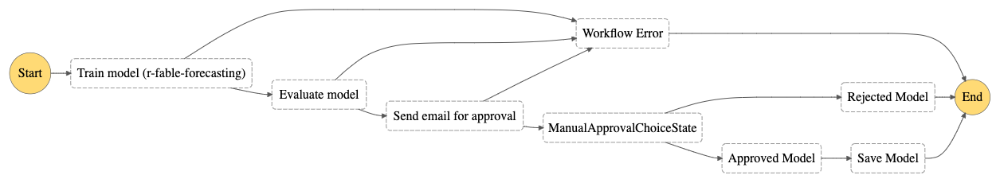

[An Amazon EventBridge rule and a AWS CloudTrail Trail](https://docs.aws.amazon.com/eventbridge/latest/userguide/log-s3-data-events.html) are setup so that a new execution of the AWS Step Functions workflow can be triggered when data is dropped on to a specific bucket location. The workflow starts with a SageMaker Training job (`Train model (r-fable-forecasting)`) to train a forecasting model using the container we have built, and generates evaluation report for the model using a SageMaker Processing job (`Evaluate model`). Then a AWS Lambda function is executed to send an email which includes model information and evaluation to a reviewer using [Amazon Simple Email Service (SES)](https://aws.amazon.com/ses/) (`Send email for approval`). Also within the email, reviewer can decide to approve the model or reject the model with a click of an hyperlink, backed by [Amazon API Gateway](https://aws.amazon.com/api-gateway/). Once approved, the model is created and is saved as a [SageMaker Model](https://docs.aws.amazon.com/sagemaker/latest/dg/deploy-model.html) (`Save Model`) for inference use.

The architecture diagram is shown below.

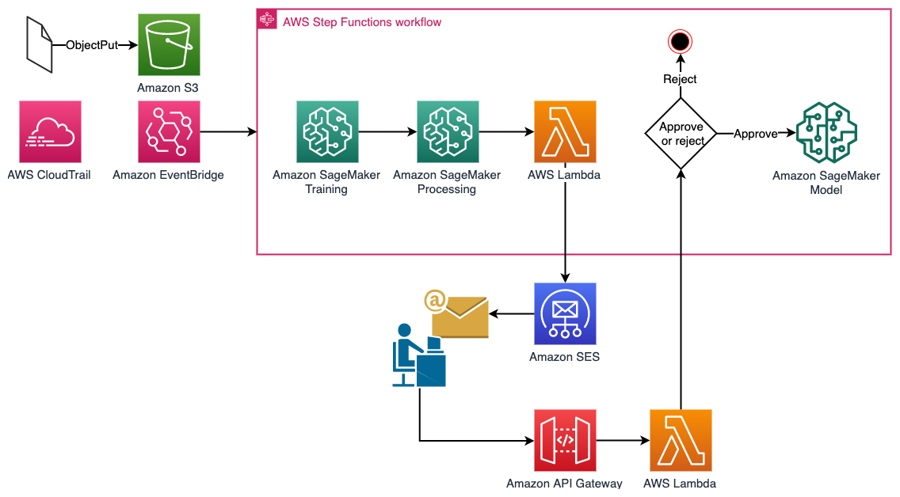

### Setup
Don't worry. All the resources in the architecture is ready for you to deploy in a CloudFormation template. Please follow the links to create a new stack with [the other template](./cloudformation/human_approval.yaml) in the [CloudFormation console](https://us-west-2.console.aws.amazon.com/cloudformation/home?region=us-west-2#/stacks/create/template). This time, you would need to provide the following parameters:
- **ContainerImage**: the URI of the container image we used for SageMaker Training and Processing in a form of `{account-id}.dkr.ecr.{region}.amazonaws.com/r-fable-trip-forecasting:latest`. You can get it in ECR console, or the `image` variable from the script [sagemaker_training.r](./sagemaker_training.r) in the RStudio IDE.
- **Email**: an email address that is used to send and receive the evaluation report sent by Amazon SES. Note that you will receive a verification email during the CloudFormation stack creation. You must verify it before receiving emails from the workflow.
- **SageMakerExecutionRoleArn**: the IAM role ARN `role` that we use in SageMaker Training and Processing jobs in [sagemaker_training.r](./sagemaker_training.r). 
- **s3Bucket**: A S3 bucket where we are going to save the output and setup the Amazon EventBridge trigger. You can use the `bucket` defined in [sagemaker_training.r](./sagemaker_training.r).

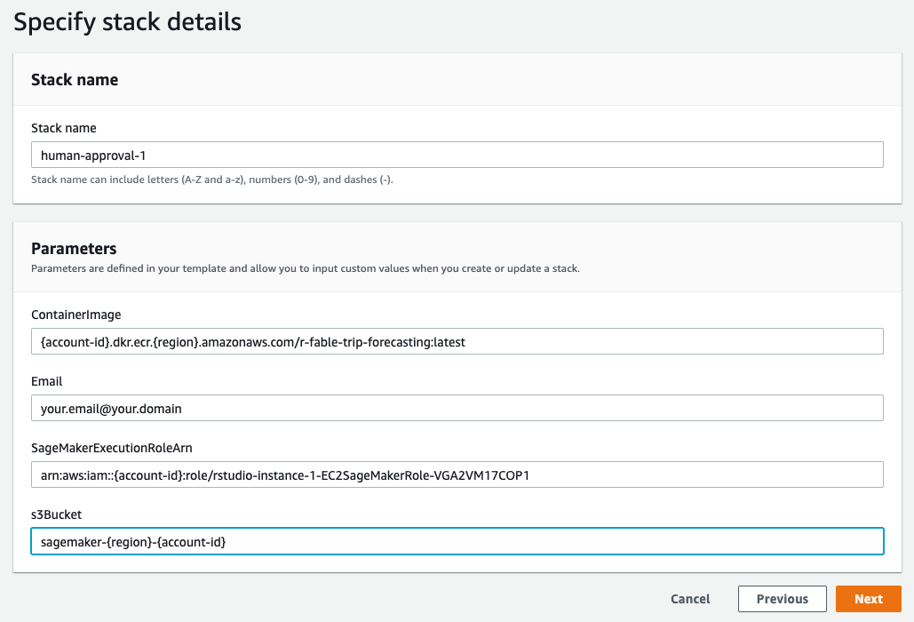

The stack creation takes about 2 minutes.

### Execution
We can trigger an execution by uploading the `tourism_tsbl.rds` to the `s3Bucket` that we defined in the stack with a prefix of `r-fable-trip-forecasting/new-data`. Why `r-fable-trip-forecasting/new-data`? Because that's how we defined [the EventRule with Amazon EventBridge](https://github.com/aws-samples/reinvent2020-aim404-productionize-r-using-amazon-sagemaker/blob/7f476b629b6d2a30913039d1acefa6f474d709ba/cloudformation/human_approval.yaml#L740). So back to the RStudio IDE, we run the following code to upload the file to S3.

```R
###################################
## Execute a StepFunctions workflow by uploading a file to a specific S3 bucket and prefix
s3_client$upload_file(rds_file, bucket, 'r-fable-trip-forecasting/new-data/tourism_tsbl.rds')
```

Switching to [AWS Step Functions console](https://us-west-2.console.aws.amazon.com/states/home?region=us-west-2#/statemachines), you can see a new execution in running state,

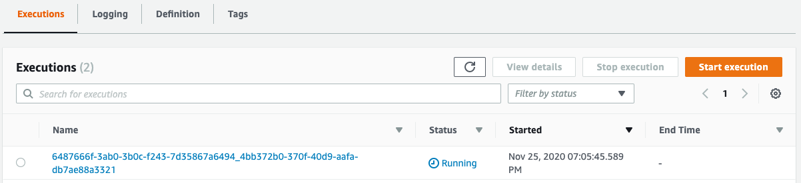

and its progress.

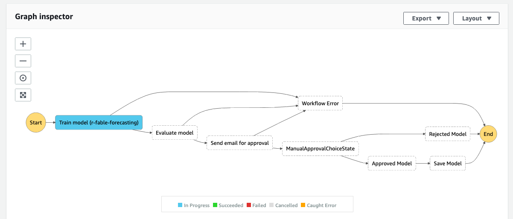

Once the workflow moves pass `Evaluate model` step, you will receive an email *"Required approval from AWS Step Functions"* with all the information about the trained model, a visualization of the forecasting that we saw during the prototyping. At the bottom, you can either approve or reject this model and will be redirected to AWS Step Functions console.

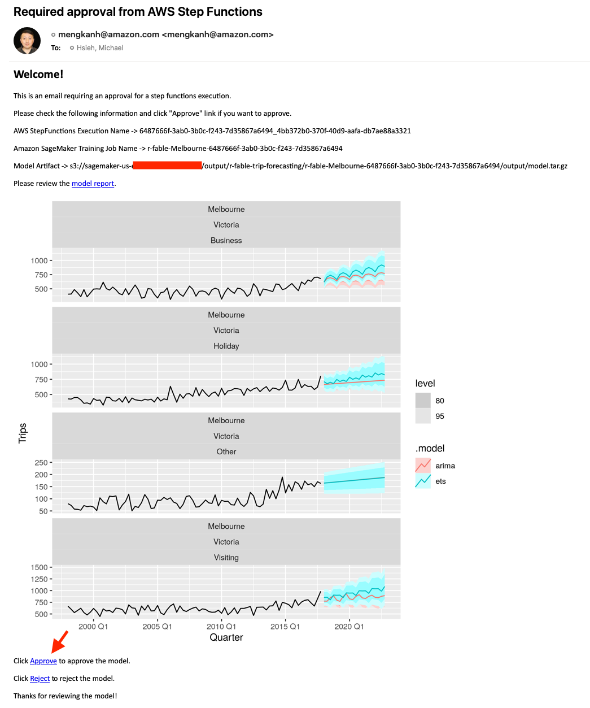

Once a model is approved, the model will become available for inference in [Amazon SageMaker Models console](https://us-west-2.console.aws.amazon.com/sagemaker/home?region=us-west-2#/models) as shown below.

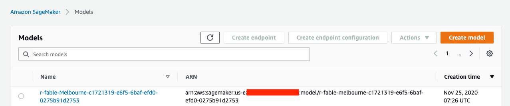

## Cleaning up
You are reaching the end of the demo. After the demo, please delete all the resources created by the two CloudFormation stacks from the [CloudFormation console](https://us-west-2.console.aws.amazon.com/cloudformation/home?region=us-west-2#/stacks?) to avoid incurring unnecessary cost. Note that the deletion initiated from CloudFormation console will not delete objects and models created by SageMaker. 

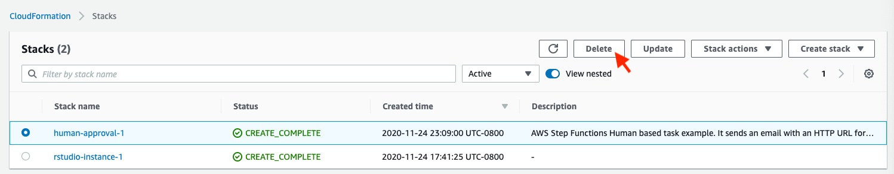

## Additional resources

The human approval architecture is inspired by and has taken parts from [Deploying a Human Approval Project](https://docs.aws.amazon.com/step-functions/latest/dg/tutorial-human-approval.html).

## Security

See [CONTRIBUTING](CONTRIBUTING.md#security-issue-notifications) for more information.

## License

This library is licensed under the MIT-0 License. See the [LICENSE](./LICENSE) file.

