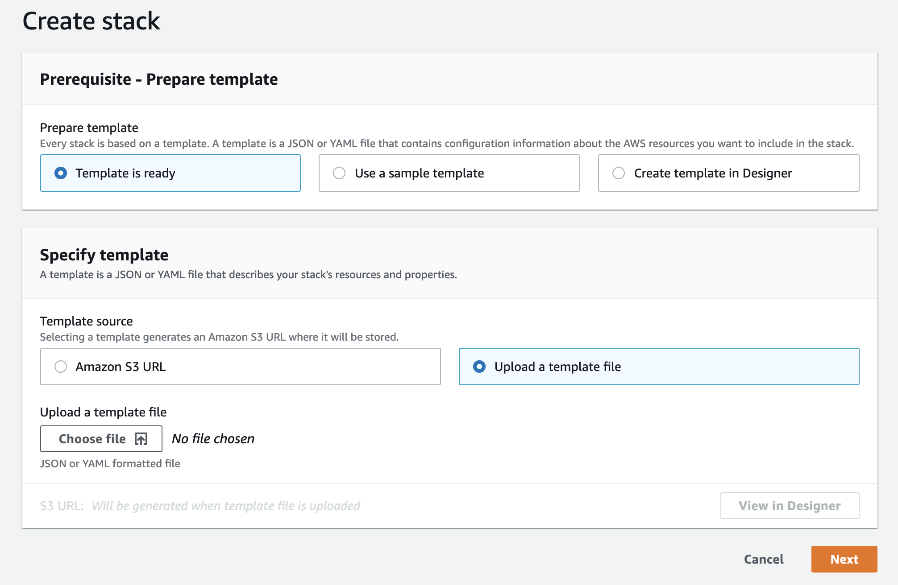
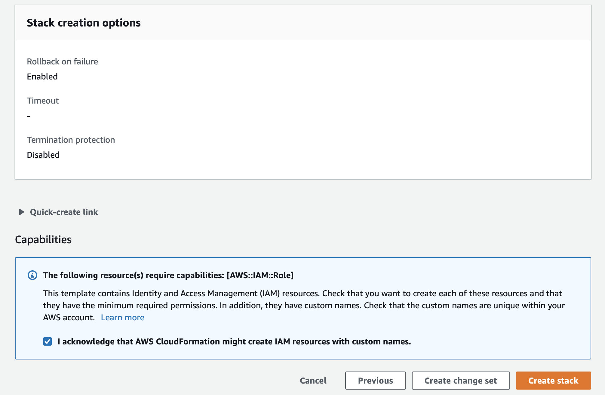
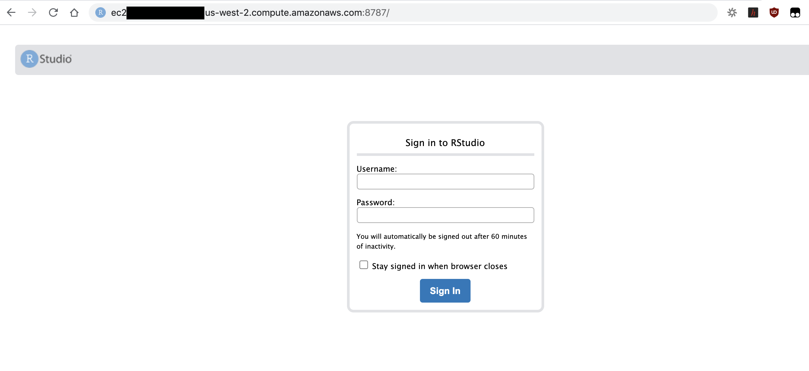

# Forecasting with Fable and train with Amazon SageMaker

Welcome to reInvent 2020 AIML session 404 How to productionize R workloads using Amazon SageMaker. In this repository, the code is provided for you to replicate the demo in the session. You are welcome to clone the repository while you watch the video.

R language and its rich ecosystem with more than 16,000 packages dedicated to statistics and machine learning are widely used by statisticians and data scientists in industries, such as energy, healthcare, life science, and financial services. Customers using R can run simulation and machine learning securely and at scale with Amazon SageMaker while also reducing the cost of development by using the fully elastic resources in the cloud. In this session, learn how to build, train, and deploy statistical and ML models in R at scale using Amazon SageMaker from your IDE.

## Prerequisite
We assume you have a RStudio IDE working from your laptop or on a EC2 instance. You will need the following IAM policies: `AmazonSageMakerFullAccess` and `AmazonEC2ContainerRegistryFullAccess` to be attached to your IAM role that is used in your local environment, eg. EC2 or local. If not, please deploy a CloudFormation template we prepared for your convenience. You will be spinning up all the necessary resource to run a RStudio Server.

Please follow the [link](https://us-west-2.console.aws.amazon.com/cloudformation/home?region=us-west-2#/stacks/create/template) to create a new stack in CloudFormation. Note that the region is currently set as us-west-2, please switch to your region if needed. Choose **Upload a template file**, **Choose file**, select the [ec2_ubuntu_rstudio_sagemaker.yaml](./ec2_ubuntu_rstudio_sagemaker.yaml), and hit **Next**.



In Step 2 **Specify stack details**, you will be prompted to enter a **Stack name** and an **EC2 key pair**. Pick any name and select the key pair *ee-default-keypair.pem* from Event Engine then hit **Next**. 

In Step 3 **Configure stack options** page, we will bypass any options and keep default values, hit **Next**.

In Step 4 **Review**, please acknowledge and hit **Create Stack**. The stack creation will take about 5 minutes to get EC2 instance up and running, and another 5-10 minutes for RStudio to install some prerequisites.




Once the stack creation completes, go to **Output** tab to find the RStudio IDE login URL: `ec2-xx-xxx-xxx-xxx.us-west-2.compute.amazonaws.com:8787`. Copy the URL and paste it in your favorite browser. 





Login the RStudio instance with username **ubuntu** and password **rstudio**. 

## Prototpying in RStudio

Suppose your customer send you a dataset and ask you to forecast the number of visitors to city of Melbourne in Australia for the next 5 years. Let’s log on to the IDE to start playing with the data. You will start with the prototyping script [fable_demo.r](./fable_demo.r) where we do a simple exploratory analysis, visualization and modeling using ETS and ARIMA algorithms. 


It is perfectly fine running small scale analyses, modeling and visualization on a local instance. But what if each of your modeling job takes an hour with complete dataset and you need to run 100s of them with various input and parameters. You either need to have a very large instance and run them both in parallel and in serial. 

## Scale with Amazon SageMaker

[Amazon SageMaker](https://aws.amazon.com/sagemaker/) can be helpful in running your statistical and ML workloads at scale using the fully elastic resource in the cloud beyond local compute resource. 

First of all, data scientists and developers can use Amazon SageMaker features through [SageMaker SDK](https://sagemaker.readthedocs.io/en/stable/) from any IDE as long as there is internet and AWS credential setup. For R users, you can use your preferred IDE, such as RStudio, and interact with [Amazon SageMaker SDK](https://sagemaker.readthedocs.io/en/stable/) through [reticulate](https://rstudio.github.io/reticulate/), an R interface for python libraries. You can also communicate with all AWS resources with [boto3](https://boto3.amazonaws.com/v1/documentation/api/latest/index.html). 

Depending on whether there is a model artifact as output for inferencing new data, the following two patterns can be leveraged to scale your ML or statistical workloads. 

For machine learning, you can use Amazon SageMaker Processing to process the data, use Amazon SageMaker Training and Tuning to train an optimal model, and use Amazon SageMaker Endpoint to host the model for live traffic or Batch Transform for batch data.

For statistical analyses, simulations and optimizations where your output is data insight, you can use Amazon SageMaker Processing for both data processing and for your full scale statistical workloads, and save the results into Amazon S3 or purposefully built database on AWS.

We will walk through step-by-step to transform our prototype script to SageMaker-ready script.

Amazon SageMaker runs your script in a container image with all the dependencies to make sure it will operate in the exact manner how you develope the script. We will build a R container using a shell script that reads the [Dockerfile](./Dockerfile). There are two changes we need to make:

1.  Make the script aware of how Amazon SageMaker places the input and config files when launching the job;

   The input data and hyperparameters will be accessible to your script inside a container with the following directory structure. 

   ```
   /opt/ml
   |-- input
   |   |-- config
   |   |   |-- hyperparameters.json
   |   |   `-- resourceConfig.json
   |   `-- data
   |       `-- <channel_name>
   |           `-- <input data>
   |-- model
   |   `-- <model files>
   |-- processing (if with SageMaker Processing)
   |   |-- input
   |   `-- output
   |
   `-- output
       `-- failure
   ```
   We should assign the path variables accordingly so that we can access the input data for analysis and modeling. (insert link to the lines)

   ```R
   ## Assigning paths
   prefix <- '/opt/ml'
   input_path <- file.path(prefix, 'input', 'data')
   training_data_path <- file.path(input_path, 'train')
   output_path <- file.path(prefix, 'output')
   model_path <- file.path(prefix, 'model')
   param_path <- file.path(prefix, 'input', 'config', 'hyperparameters.json')
   
   processing_path <- file.path(prefix, 'processing')
   processing_input_path <- file.path(processing_path, 'input')
   processing_output_path <- file.path(processing_path, 'output')
   ```

2. Refactor the code into **train**, **evaluate** and **serve** as that how SageMaker execute the codes from the container for training, evaluating and serving the model. 

   In our prototype, we do a forecast modeling, followed by an analysis of the model performance and a visualization. We will be refracting the modeling part into the function `train` (insert link to the lines) and the analysis into `evaluate`. We will be calling the `train` and `evaluate` separately by SageMaker using SageMaker Training and Processing, respectively.

   ```R
   train <- function() {
   	## Extract (hyper)parameters
     ...
     ## Getting data from local path that is downloaded from S3
     ...
     ## Training ETS and ARIMA models
     fitted_model <- tourism_city %>%
       model(
         ets = ETS(Trips ~ trend(ets_trend_method), ic = ic),
         arima = ARIMA(Trips, ic = ic)
       )
     ## Saving the model
     ...
   }
   
   evaluate <- function(city) {
     ## Load model
     ...
     ## Load input data
     ...
     ## Analysis
     ...
     ggsave(file.path(processing_output_path,  'forecast-report.png'))
   }
   ```

   

The SageMaker-ready script is in [fable_sagemaker.r](./fable_sagemaker.r). 

Now we are ready to run the script [fable_sagemaker.r](./fable_sagemaker.r) with Amazon SageMaker. Let's open the script [sagemaker_training.r](./sagemaker_training.r). We will be communicating with Amazon SageMaker using the SageMaker SDK through reticulate, a R interface to python libraries. 

```R
## Getting libraries
library(reticulate)
sagemaker <- import('sagemaker')
boto3 <- import('boto3')
```

We will build a container image defined in the  [Dockerfile](./Dockerfile) and push the container image to Amazon Elastic Container Registry (ECR) with a series of shell commands in [build_and_push_docker.sh](./build_and_push_docker.sh).

```R
# Amazon SageMaker runs your code in a container image with the dependencies.
# We build a R container using the shell script that reads the Dockerfile
container <- 'r-fable-trip-forecasting'
tag <- 'latest'
system(sprintf('./build_and_push_docker.sh %s %s', container, tag))
```

Once the container image is pushed to ECR, you can verify the image in the [console](https://us-west-2.console.aws.amazon.com/ecr/repositories/r-fable-trip-forecasting/?region=us-west-2) (the URL assumes region to be us-west-2). 

We can now run our script in the fully managed Amazon SageMaker Training infrastructure, using the `Estimator` class from the SageMaker SDK.

```R
###############################
## Initiate SageMaker Estimator
estimator <- sagemaker$estimator$Estimator(role = role,
                                           image_uri = image,
                                           instance_type = 'ml.m4.xlarge',
                                           instance_count = 1L,
                                           volume_size_in_gb = 5L,
                                           max_run = 3600L,
                                           input_mode = 'File',
                                           base_job_name = 'r-fable-trip-forecasting',
                                           output_path = output_path,
                                           sagemaker_session = session, 
                                           hyperparameters = hyperparameters)

estimator$fit(inputs = list('train'=training_input), 
              wait = TRUE) # wait = FALSE submits an async job and get the RStudio console back
```

Note that we can easily specify the right-sized compute resource with `instance_type`, `instance_count` and EBS size `volume_size_in_gb`.  When you execute the `$fit()`, the specified compute infrastructure will be provisioned, your container image will be pulled from ECR repository, the input data will be downloaded from S3 location to start the training. You will see the logs in action in the RStudio console. You may also turn the `wait` argument to `FALSE` so that the `$fit()` call will be an asynchronous one. Essentially you are submitting the training to Amazon SageMaker and you will be able to move on to the following activities such as more prototyping or submit another job with a different set of parameters.  

Once this training job is done, we can move on to evaluate the model performance with Amazon SageMaker Processing using `ScriptProcessor` class. We need to specify the input to be the trained model for evaluation, and an output path for saving the evaluation report.

```R
processing_input <- list(sagemaker$processing$ProcessingInput(input_name = 'model-for-evaluate', 
                                                              source = estimator$model_data, 
                                                              destination = '/opt/ml/processing/input'))
processing_output <- list(sagemaker$processing$ProcessingOutput(output_name = 'evaluation-output', 
                                                                source='/opt/ml/processing/output', 
                                                                destination = output_processing_path))
```

## Security

See [CONTRIBUTING](CONTRIBUTING.md#security-issue-notifications) for more information.

## License

This library is licensed under the MIT-0 License. See the [LICENSE](./LICENSE) file.

